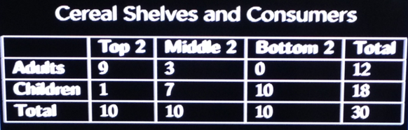
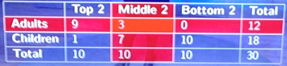
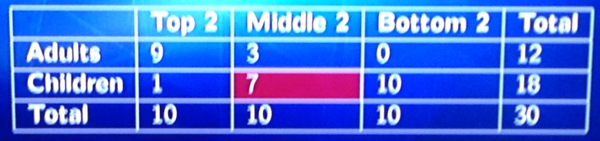
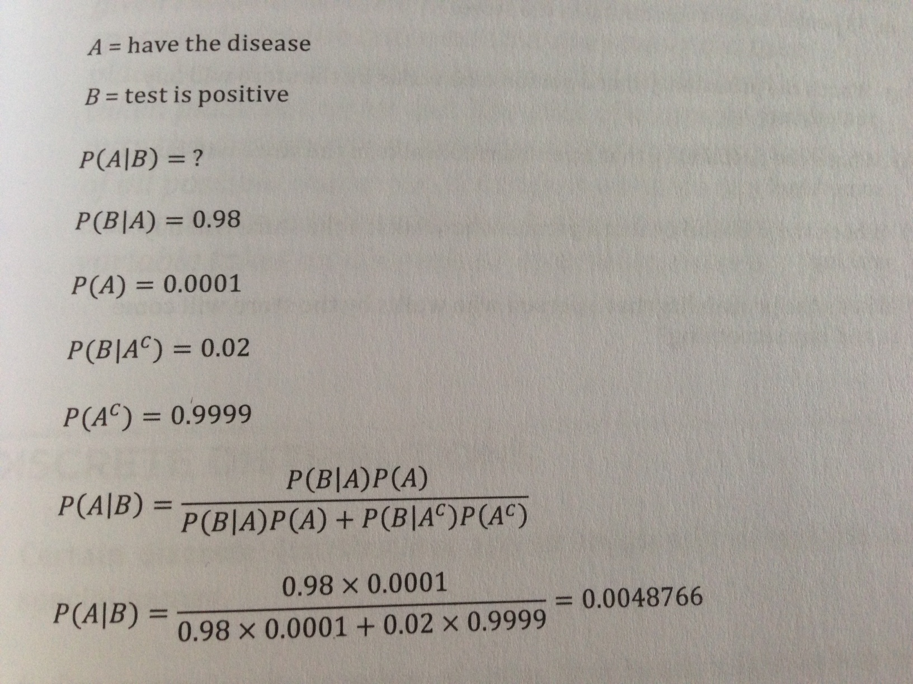

## 3.  Sampling and Probability

Two fundamental ideas in statistics are:  
1. Uncertainty  
2. Variation  

Probability is the foundation that helps us understand uncertainty and variation. 
Probability is a mathematical language used to measure uncertain events.  
Life events are full of uncertainty due to variation, meaning when we collect data (or make measurements) and if the same measurements were repeated, the answer would be slightly different.

### General Process of Investigation

1. State the Question  
i.e. Drinking caffeinated beverages affects men differently than women.  Or a new cold medicine will relieve coughing within 48 hours.

2. Collect Data  
that helps answer the question.  i.e. give cold medicine to your coughing friends and record how many stopped coughing within 48 hrs.  Ready to move on?  No, we introduced a bias - our friends probably have the same characteristics as we do ( same age bracket, live in the same city, or same gender).  Need to collect data that's objective and rigorous.  To remove bias entirely, you have to collect a sample where every person has an equal chance of being selected. 

3.  Analyze the Data  
Look at the data to get an overall picture of it.  Use plots, graphs, tables to reveal patterns or relationships within the data. Visualizations are more effective to present data than a mass of numbers - can see clusters, outliers, distributions (many values vs only a few values). Statisticians also use formal techniques, i.e. hypothesis testing and linear regression to determine if and how much the data supports the original claim.

4. Draw a Conclusion  
i.e. Study shows the new medicine relieves coughing in 48 hrs, guaranteed.  This conclusion is too strong, zero uncertainty is too good to be true.  You do want to extend the results from your sample data to the overall population more generally.

### Sampling  
Selecting, at random, one or more of all possible outcomes (ideally, in proportion to their likelihood). i.e. Sample of Americans for a political poll.  

Sampling helps draw inferences about the large population of outcomes.   

Probability is about considering all the possible outcomes and quantifying their chances. P refers to the long run - because we can't accurately determine a probability with a small number of observations.  i.e. 10 right handed people doesn't mean everybody is right-handed.

#### Real but Limited Data  


Event A = {adult breakfast cereal}  
Event B = {Breakfast cereal is on middle two rows}  

-- Marginal Probability

Question: Probability that breakfast cereal is targeted at adults?  
P(A) = 12 / 30 = 0.40  

Question: Probability that breakfast cereal is located on the middle two rows?  
P(B) = 11 / 30 = 0.33  


-- How two events relate to each other  

-- Joint Probability - intersection  
  
Question: Probability that cereal is targeted at adults AND located on the middle two shelves?  
P(A & B) = 3 / 30 = 0.1  

-- Union  
Question: Probability that cereal is targeted at adults OR located on the middle two shelves?  
P(A U B) = (12 / 30) + (10 / 30) - (3 / 30) = 19 / 30 = .63  

-- Conditional Probability  
We can update our probabilities by conditioning on new given information.  
Event C = {children breakfast cereal}

Question: Probability that breakfast cereal is targeted at children?  
P(C) = 18 / 30 = 0.6  

Question: Probability that cereal is targeted at children AND located on the middle two shelves?  (intersection)  
P(C & B) = 7 / 30 = 0.23  

Question: Probability that cereal is targeted at children GIVEN that it's located on the middle two shelves?  (conditional)  
  
P(C | B) = 7 / 10 = 0.7  
The conditional probability is higher.

### Formal definitions  

Experiment - an action whose outcome is uncertain.  
i.e. Flipping a coin or rolling a dice twice.  

Sample space  - a set of all possible outcomes of an experiment.  
i.e. S = {H,T}, or  
S = {(1,1), (1,2),...,(1,6),...,(6,1),...,(6,5),(6,6)}  

Event - a colleciton of outcomes of the experiment.  
i.e. Flip a head or {H}, or
the sum equals 4 {(1,3), (2,2), (3,1)}

Probability - a rule assigning each event a value on [0,1] reflecting the chance of the event occuring.  
When all outcomes are equally likely P = S / S + F  
i.e. P(H) = 0.5  
P({sum equal 4}) = 3 / 36  

Union - probability of A or B  
Intersection - probability of A and B  

#### Axioms of Probability  
1.  For any event A, prob of A is between 0 and 1.  
2.  If S is a sample space, P(S) = 1 and P(empty set) = 0.  empty set is no event.  
3.  A complement P(A complement) = 1 - P(A)  

About Mutually Exclusive Events  
If A and B are mutually exclusive (disjoint), then P(A or B) = P(A) + P(B)  

About Not Mutually Exclusive  
P(A or B) = P(A) + P(B) - P(A and B)  

If Mutually Exclusive  
P(A and B) = 0  

If A and B are independent,  
P(A or B) = P(A)P(B)  

#### Conditional probability  
knowing the cereal is located on the middle two shelves changes the probability of being targeted to children:  

A and B are events with P(B) > 0, P(A|B) = P(A and B) / P(B)  

i.e. P(C|B) = P(C and B) / P(B) = (7 / 30) / (10/30) = 7/10 

Another way to view conditional probability is by solving for the intersection term:  
P(A|B) = P(A and B) / P(B)  
P(A and B) = P(A|B)P(B)  
P(B and A) = P(B|A)P(A)  
P(A|B)P(B) = P(B|A)P(A)  
Seems pretty circular, but becomes extremely useful and known as 

### Bayes' Rule  
P(A|B) = ( P(B|A)P(A) ) / P(B)  

-- Law of Total Probability  
Expand the denominator  
P(B) = P(B and A) + P (B and A complement)  
P(B) = P(B|A)P(A) + P(B|A complement)P(A complement)  

-- Another Form of Bayes' Rule  
P(A|B) = ( P(B|A)P(A) ) / (P(B|A)P(A) + P(B|A complement)P(A complement))  

#### Example - Test Positive  
You took a test for a rare disease and tested positive.  
Test is 98%  accurate  
Disease is rare and occurs in 1 out of 10,000 people.  
What's the chance you actually have the disease?  

```{r, out.width = "350px", echo=FALSE}

```

